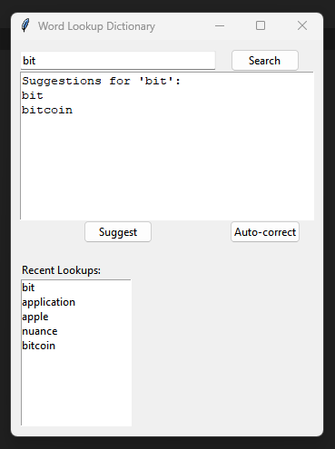

# 📚 Word Lookup Dictionary

Word Lookup Dictionary is a user-friendly desktop application that brings the dictionary to your fingertips. Built with Python, it combines a local word database with online definition lookup, providing a comprehensive and efficient word reference tool.



## ✨ Features
- 🔍 Word Definition Lookup: Instantly search for definitions of English words.
- 📖 Local Dictionary: Maintains a robust local word list for lightning-fast verification.
- 🌐 Online Definition Retrieval: Fetches up-to-date definitions from Merriam-Webster's online dictionary.
- 💡 Auto-suggestion: Intelligent word suggestions based on partial input.
- ✏️ Auto-correction: Offers smart corrections for misspelled words.
- ⚡ Caching: Stores recently looked-up definitions for blazing-fast access.
- 🕰️ Search History: Keeps track of your recent word lookups for easy reference.
- 🖥️ User-friendly GUI: Clean and intuitive graphical user interface.

## 🚀 Setup and Installation
1. Clone the repository:
 ```bash
git clone https://github.com/adityakch/Word-Lookup-Dictionary.git
```
3. Install required packages:
```bash
pip install -r requirements.txt
```
5. Ensure you have a `data/word_list.txt` file with a list of English words (one word per line).
6. Run the application:
```bash
python src/main.py
```

## 📖 Usage
- Enter a word in the search box and click "Search" or press Enter.
- The definition will be displayed in the result area.
- Use the "Suggest" button for word suggestions based on partial input.
- Use the "Auto-correct" button to get spelling corrections.
- Recent lookups are displayed in the history section and can be clicked to search again.

## 🙏 Acknowledgments
- Merriam-Webster for their comprehensive online dictionary service.
